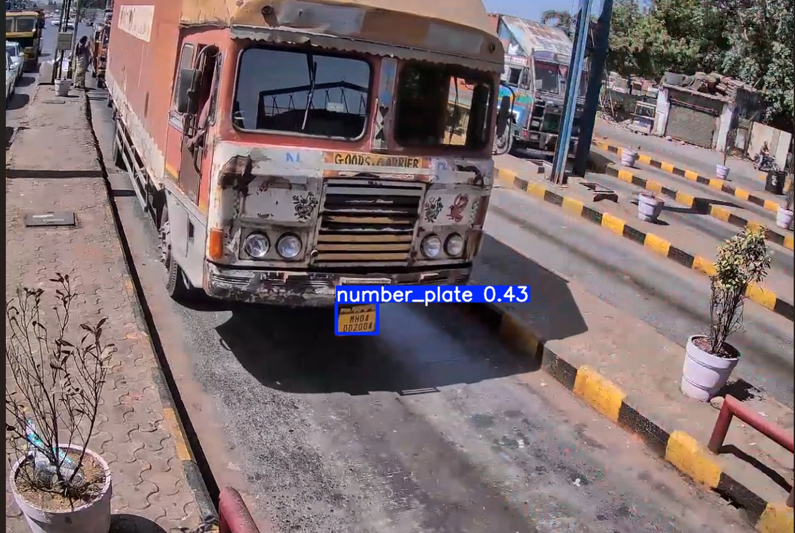

ANPR-YOLOv8-OCR

Overview
A lightweight Automatic Number Plate Recognition (ANPR) pipeline that detects vehicle license plates using YOLOv8 and extracts plate text via OCR. The system performs image-based inference and prints recognized text to the terminal.

Key Highlights

* End-to-end pipeline: Detection → Cropping → OCR
* YOLOv8-based license plate localization
* OCR inference with terminal output
* Minimal, reproducible setup with sample input/output

Project Structure

```text id="a1b2c3"
ANPR-YOLOv8-OCR/
│
├── test/
│   └── input.jpg
│
├── results/
│   └── result.png
│
├── train.py
├── test.py
├── data.yaml
├── requirements.txt
└── README.md
```

Methodology

1. Detection: YOLOv8 model identifies the license plate region in the image
2. Region Extraction: Detected bounding box is cropped
3. OCR: Cropped plate is passed to Tesseract for text recognition
4. Output:

   * Visual: bounding box rendered on the image
   * Text: recognized plate number printed in the terminal

Sample

Input


Detection Output


OCR Output (Terminal)

```bash id="d4e5f6"
MH04D02004
```

Installation

```bash id="g7h8i9"
git clone https://github.com/rajsah981852/ANPR-YOLOv8-OCR.git
cd ANPR-YOLOv8-OCR
pip install -r requirements.txt
```

Usage

```bash id="j1k2l3"
python test.py
```

On execution

* Detects the license plate and saves the result image
* Prints the recognized text in the terminal

Tech Stack

* Python
* Ultralytics YOLOv8
* OpenCV
* Tesseract OCR (pytesseract)

Limitations

* OCR accuracy varies with resolution, angle, motion blur, and lighting
* No post-processing for character correction
* Text is not overlaid on the output image (terminal-only display)

Future Work

* Overlay OCR text on output image
* Improve recognition using deep learning-based OCR
* Add preprocessing for better OCR accuracy
* Extend to real-time video/webcam inference

Author
Raj Sah
